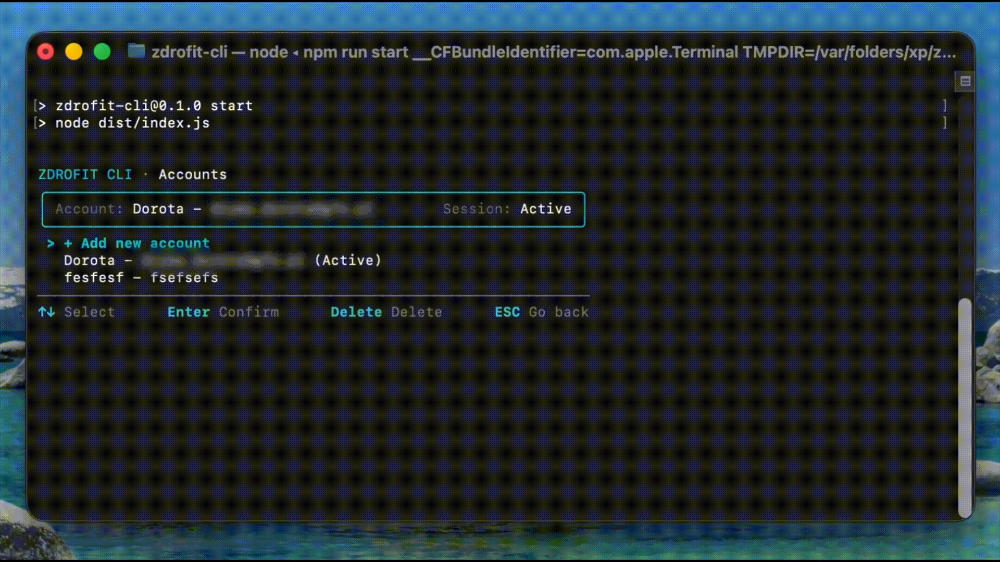
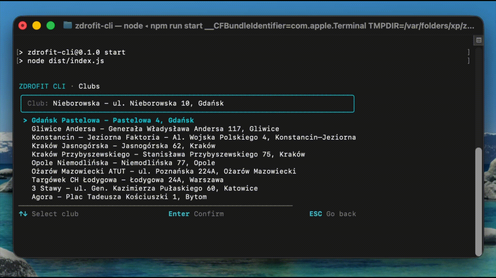
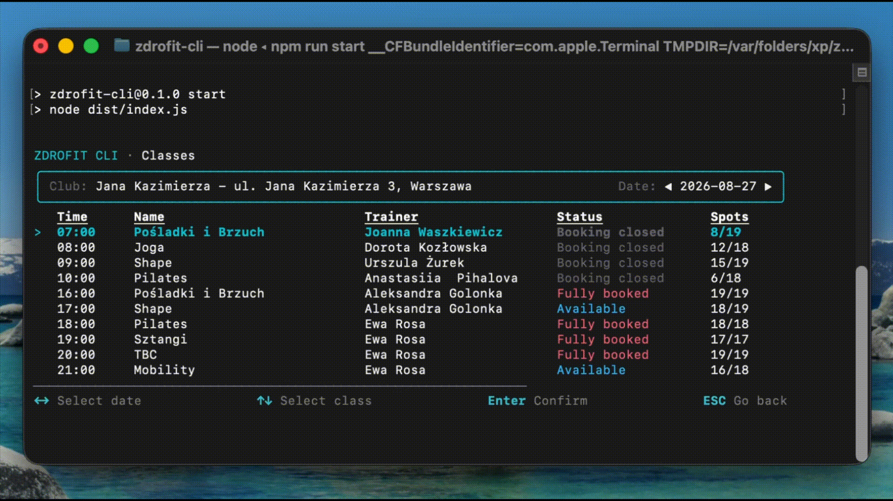
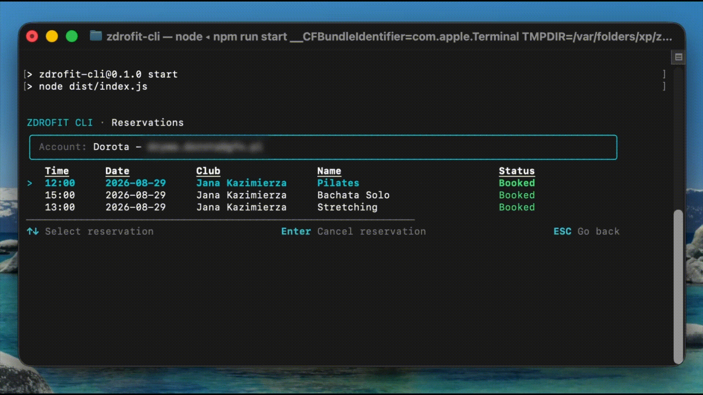

<div align="center">


### Book your Zdrofit classes without leaving the terminal.

[](...)
[](...)
[](...)
[](...)
</div>


## About

**Zdrofit CLI** is an unofficial interactive terminal client for browsing,
booking and managing Zdrofit fitness classes.

It provides a fast, keyboard-driven interface for checking class schedules,
managing reservations and working with multiple accounts without using
the Zdrofit website manually.

## Preview

<table>
  <tr>
    <td width="50%">
      
    </td>
    <td width="50%">
      <h3>1. Account Management</h3>
      <p>
        Add and manage multiple Zdrofit accounts directly from the terminal.
        Saved sessions are restored automatically, so you do not need to
        authenticate every time the application starts.
      </p>
    </td>
  </tr>

  <tr>
    <td width="50%">
      <h3>2. Club Selection</h3>
      <p>
        Browse available Zdrofit clubs, switch between locations and choose
        the club whose schedule you want to explore.
      </p>
    </td>
    <td width="50%">
      
    </td>
  </tr>

  <tr>
    <td width="50%">
      
    </td>
    <td width="50%">
      <h3>3. Browse Classes</h3>
      <p>
        Navigate the schedule by date, check class availability and browse
        upcoming sessions without leaving the terminal.
      </p>
    </td>
  </tr>

  <tr>
    <td width="50%">
      <h3>4. Manage Reservations</h3>
      <p>
        View your current reservations, keep them synchronized with Zdrofit
        and cancel booked classes directly from the CLI.
      </p>
    </td>
    <td width="50%">
      
    </td>
  </tr>
</table>

## Quick Start

Requires **Node.js 22+** and an active Zdrofit account.

```bash
npm install --global zdrofit-cli
zdrofit
```

The first installation downloads the Chromium browser used for authentication.

## Features

- 🔐 Account and session management
- 🏢 Browse Zdrofit clubs
- 📅 Browse classes by date
- ✅ Book available classes
- ❌ Cancel reservations
- 🔄 Synchronize reservations
- ⌨️ Keyboard-driven terminal interface
- 💻 Cross-platform support

## How It Works

**Zdrofit CLI** authenticates the user through a browser session and then uses
the authenticated session to communicate with the Zdrofit website.

The application:
1. Opens a browser session for authentication.
2. Stores the authenticated session locally (system credential store)
3. Fetches clubs and class schedules from the Zdrofit website.
4. Parses HTML responses into application models.
5. Sends booking and cancellation requests directly from the terminal.
6. Synchronizes local reservation data with the current state of the website.

## Tech Stack

| Technology  | Purpose                      |
| ----------- | ---------------------------- |
| TypeScript  | Application language         |
| Node.js     | JavaScript runtime           |
| React + Ink | Terminal user interface      |
| Cheerio     | HTML parsing                 |
| Playwright  | Browser-based authentication |


## Project Structure

The project follows a feature-based structure that separates
UI, business logic, data access and infrastructure concerns.

```text
src/
├── features/
│   ├── account/
│   ├── clubs/
│   ├── classes/
│   └── reservations/
├── components/
├── screens/
├── infrastructure/
├── constants/
└── index.ts
```

## Development

```bash
git clone https://github.com/1maciek90/zdrofit-cli.git
cd zdrofit-cli
npm install
npm run typecheck
npm run build
npm start
```

## Disclaimer

**Zdrofit CLI** is an independent, unofficial project and is not affiliated
with, endorsed by or associated with Zdrofit or Benefit Systems S.A.

## License

This project is licensed under the [MIT License](LICENSE).


